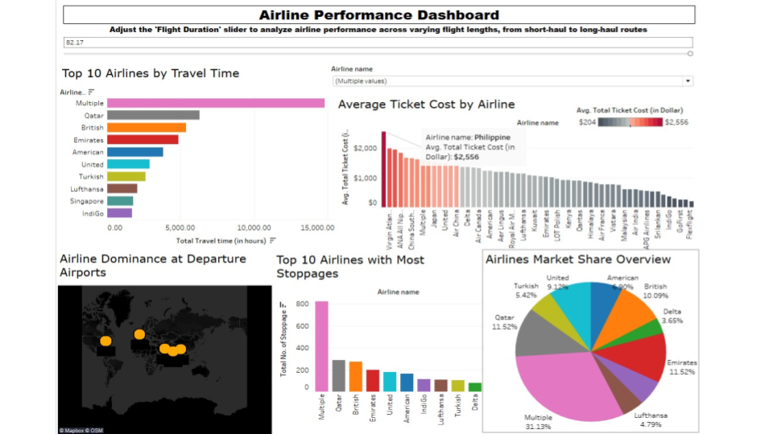
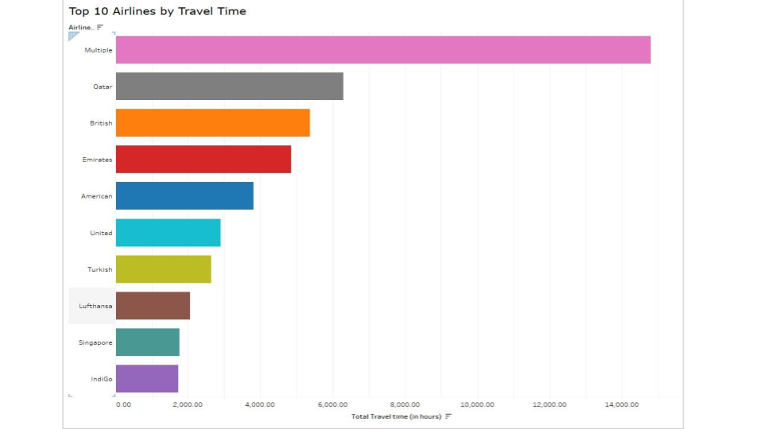
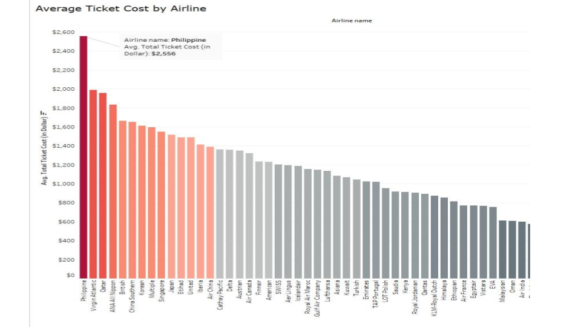
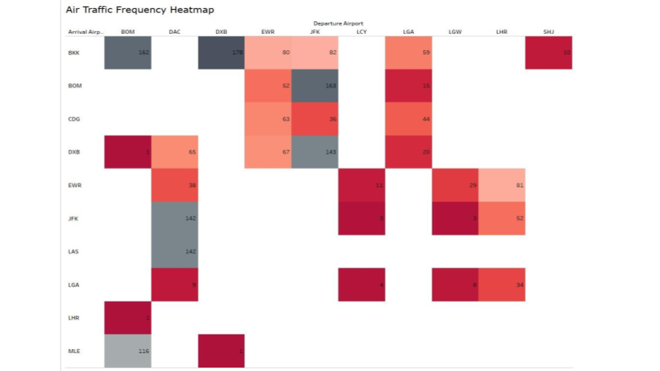
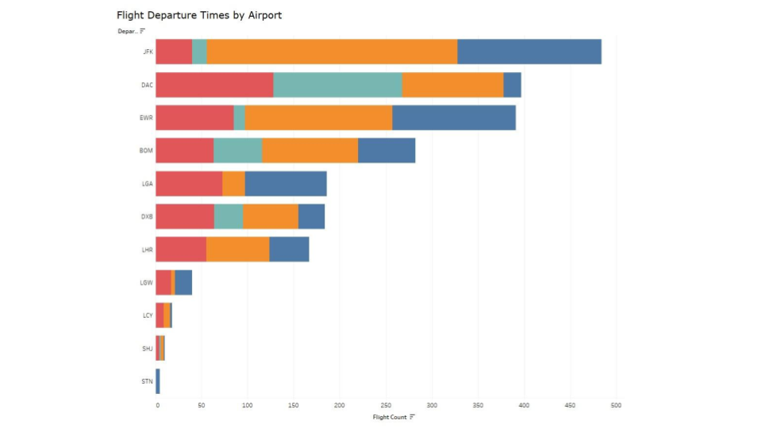

## Airline Performance Tableau Dashboard

---

### About this project
This project focuses on analyzing airline operations using Tableau to uncover patterns in travel time, stoppages, ticket prices, flight frequency, and market share. The goal was to design an interactive dashboard that provides insights into airline performance and passenger travel behavior.

The dashboard enables exploration of key operational metrics and supports data-driven decision-making for airline strategy and route optimization.

---

### Tools Used
- Tableau  
- Excel  
- Data cleaning & transformation  
- Calculated fields and parameters  

---

### Dataset
The dataset includes airline records with attributes such as ticket price, departure airport, total travel time, stoppages, and flight frequency. It provides a comprehensive view of airline operations across multiple routes.

---

### What I worked on
- Data cleaning and preparation in Tableau  
- Creation of calculated fields (cost per hour, waiting time, stoppages)  
- Design of interactive dashboard with filters and parameters  
- Development of multiple visualizations including bar charts, heatmaps, maps, and trend lines  
- Interpretation of airline operational and pricing patterns  

---

### Key Insights
- Alliance flights (“Multiple”) dominated total travel time and stoppages  
- One-stop flights showed higher ticket costs compared to nonstop routes  
- JFK emerged as the busiest departure airport  
- Evening departures were most common across major hubs  
- Certain routes showed strong travel demand and traffic concentration  

---

## Dashboard Highlights

---

### Dashboard Overview

This overview dashboard provides a high-level summary of airline performance, enabling users to explore pricing, stoppages, and travel time patterns interactively.

---

### Travel Time Analysis

This visualization highlights differences in total travel time across airlines and stoppage categories, revealing operational efficiency patterns.

---

### Ticket Price Analysis

Ticket price trends show how stoppages and airline choice influence fare variations, helping identify premium and budget travel segments.

---

### Route Heatmap

The route heatmap identifies high-traffic routes and travel demand clusters, supporting route optimization insights.

---

### Departure Patterns

Departure time analysis highlights peak travel windows and airline scheduling behavior across major airports.

---

---

### How to use
1. Download `airline_dashboard.twbx`  
2. Open in Tableau Desktop  
3. Interact with filters and parameters to explore airline insights  

---

### Timeline
Developed as part of Visual Analytics coursework (2025).
